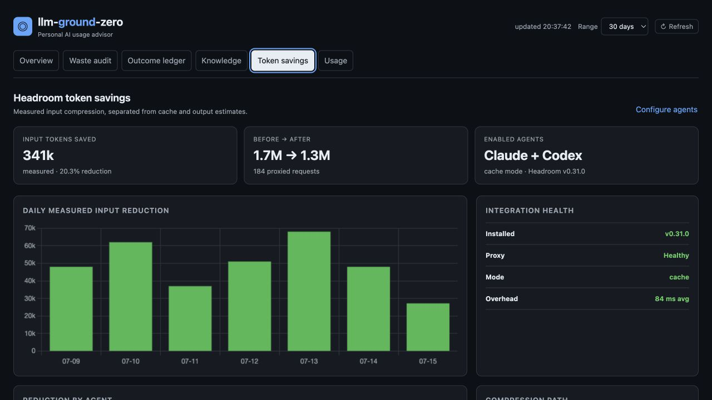
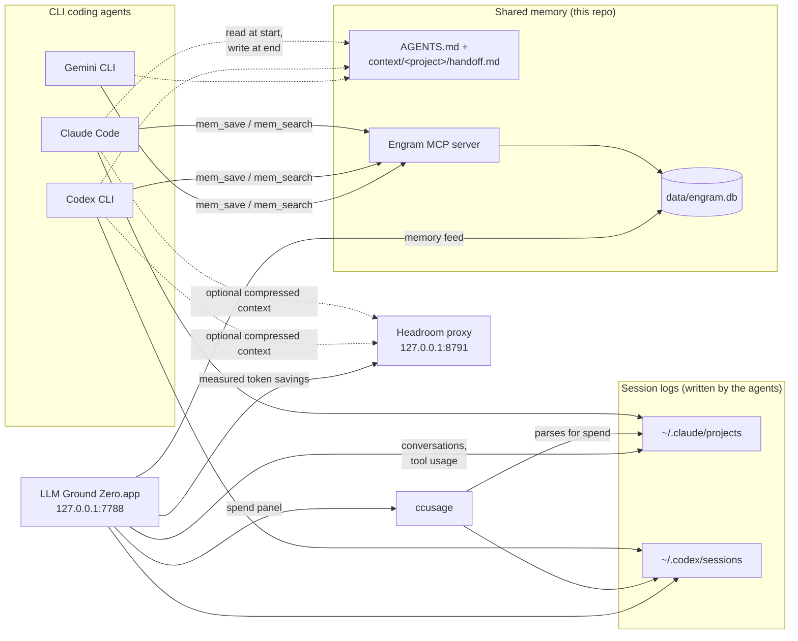

# llm-ground-zero

> One memory, every coding agent. A shared brain + usage and token-savings dashboard for
> Claude Code, Codex CLI, Gemini CLI and friends — on subscription plans,
> with no API keys.



I built this because I kept switching between CLI coding agents mid-task —
Claude Code for one thing, Codex for another — and every switch meant
starting from zero. Each agent had amnesia about decisions the previous one
made. And since I'm on subscription plans, I had no idea what my usage would
actually cost in API terms. If you run more than one coding agent, this can
be useful to you too.

## What you get

- **A macOS app** showing spend (API-equivalent $), tool usage, recent
  conversations across agents, and your agents' shared memory feed — all
  read from local files, nothing leaves your machine
- **An AI Usage Advisor** that turns those local records into an outcome
  ledger, explainable workflow-friction signals, reusable-knowledge prompts,
  and evidence-backed next actions
- **Optional Headroom compression** for Claude Code and Codex, independently
  enabled, with measured before/after/saved token totals, per-agent reduction,
  daily trends, transform activity, and proxy overhead
- **Shared memory between agents** — switch from Claude Code to Codex
  mid-task and it picks up where the other left off, via file-based handoffs
  and a searchable Engram memory store over MCP
- **No API keys anywhere** — built for subscription plans

## Install

**The app:**

```bash
brew install --cask douglas-vaz/tap/llm-ground-zero
xattr -dr com.apple.quarantine "/Applications/LLM Ground Zero.app"
```

The `xattr` line is needed because the app is unsigned and macOS Gatekeeper
blocks it otherwise — it's open source, read it before running it if that
concerns you. (On Homebrew 4.x you can use
`brew install --cask --no-quarantine` instead.)

Homebrew 6+ uses tap trust for third-party taps. Installing the fully-qualified
cask above trusts only `douglas-vaz/tap/llm-ground-zero`, which is narrower
than trusting the whole tap.

No Homebrew? Grab the `.dmg` from [GitHub Releases](https://github.com/douglas-vaz/llm-ground-zero/releases).

No app needed? Run the browser-only dashboard instead:

```bash
cd app && npm run serve   # → http://localhost:7788
```

**The agent wiring** (shared memory, AGENTS.md, usage tools):

```bash
git clone https://github.com/douglas-vaz/llm-ground-zero ~/llm-ground-zero
cd ~/llm-ground-zero && ./setup.sh
```

`setup.sh` is idempotent. It installs Engram, ccusage, and tokscale; registers
the Engram MCP server with every detected agent; and wires `agents/AGENTS.md`
into each agent's global instructions. Restart your agents afterwards.

### Optional: enable Headroom

[Headroom](https://github.com/headroomlabs-ai/headroom) runs a local proxy that
compresses eligible context before it reaches the model. It is never installed
or enabled by default. To install the tested version and enable it for both
supported agents:

```bash
./setup.sh --headroom claude,codex --headroom-mode cache
```

Use `claude` or `codex` alone to enable only that agent. After Headroom is
installed, the app's **Settings** dialog can change the selected agents or
switch between `cache` mode (the default, tuned for stable provider prompt
caches) and `token` mode (maximum prompt reduction). Applying with neither
agent selected removes LLM Ground Zero's Headroom profile and restores the
provider configuration managed by Headroom.

Gemini remains available for shared memory and usage reporting, but Headroom
v0.31.0 does not expose Gemini CLI as a persistent-install target, so its
Headroom toggle is intentionally disabled.

## How it works



All dashboard data access stays local. The advisor writes only your explicit
subscription settings and outcome corrections to an app-owned JSON file. When
you explicitly apply Headroom settings, the app delegates reversible provider
configuration and local-service management to Headroom's official installer;
it never edits those provider files itself. It never edits session logs, shared
handoffs, or Engram memories.

Memory lives in two tiers.

**Tier 1 — files, always loaded.** Each agent reads
`~/llm-ground-zero/context/<project>/handoff.md` at session start. No
retrieval step, no misses. When you switch agents mid-task, the outgoing
agent writes a handoff and the incoming one reads it.

**Tier 2 — Engram, searchable.** Long-tail memory (decisions, gotchas,
personal preferences) lives in a single SQLite file at
`~/llm-ground-zero/data/engram.db`, exposed to every agent over MCP. Any
agent can call `mem_search` to recall relevant past decisions across all your
projects. Backup = copy the file.

The dashboard reads: `ccusage` data for spend, `~/.claude/projects` for
Claude conversations and tool usage, `~/.codex/sessions` for Codex
conversations, and `engram.db` for the memory feed. All agent-owned sources
are read-only and local. When enabled, it also reads sanitized token counters
from Headroom's local CLI/logs; prompts, responses, request IDs, credentials,
and raw logs are never sent to the browser. The server binds to `127.0.0.1`
only.

## AI Usage Advisor

The app opens on an advisory overview with four connected views:

- **Overview** summarizes outcome yield, activity allocation, pricing coverage,
  plan fit, and up to three ranked recommendations.
- **Waste audit** detects explainable patterns such as repeated briefings,
  repeated file reads, failure churn, and explicit reverts. Each signal includes
  confidence, recurrence, estimated impact, and inspectable evidence.
- **Outcome ledger** cautiously classifies sessions as shipped, completed,
  paused, or unreviewed. You can correct the status, type, and note; your manual
  classification always wins.
- **Knowledge** surfaces observed captures and memory-assisted sessions, then
  suggests decisions or recurring workflows that may be worth saving.

The original spend, charts, conversations, tools, and memory feed remain in the
**Usage** view. The shared 7/30/90-day range control refreshes advisor analysis;
settings let you enter subscription costs for plan-fit context.

## Token savings

The **Token savings** view reports Headroom's locally measured input
compression over the selected 7/30/90-day range:

- tokens before compression, tokens after compression, and the difference;
- the weighted reduction rate (`saved / before`) overall and by agent;
- daily saved-token and reduction trends, actual log coverage, transforms used,
  proxy health, and average optimization overhead.

These figures are your measured proxy records, not Headroom's benchmark claim.
Provider cache reads, CLI filtering, and output-shaping estimates are different
counterfactuals and are not added to the measured input-compression number.
Output shaping, Headroom memory, learning, and anonymous telemetry are disabled
by this integration; Engram remains the shared-memory authority.

Advisor recommendations are deterministic heuristics, not model judgments.
They show confidence and data coverage, treat unsupported zero-dollar pricing
as **unpriced** rather than free, and avoid cancellation advice until there is
enough history and pricing coverage. Draft CTAs only preview and copy text: they
never silently write rules, context packs, decisions, skills, or memories.

## Troubleshooting

If a panel shows an error, check `~/Library/Logs/llm-ground-zero/error.log`.
The log contains only anonymized error data — no conversation content,
usernames, or file paths — so it is safe to attach to a GitHub issue.

For Headroom, open **Settings** and check the version, profile health, selected
agents, and mode. The integration pins `headroom-ai[proxy]==0.31.0`, keeps its
state under `~/Library/Application Support/LLM Ground Zero/headroom`, and owns
only the `llm-ground-zero` deployment profile on port 8791. Re-running the
optional setup command reconciles that profile without touching unrelated
Headroom installations.

## Per-agent reference

`setup.sh` handles all of this automatically. The manual equivalents are here
for troubleshooting or agents the script does not yet support.

### Claude Code

```bash
claude mcp add --scope user engram --env ENGRAM_DATA_DIR="$HOME/llm-ground-zero/data" -- engram mcp
```

Shared instructions: `~/.claude/CLAUDE.md` gets the import line
`@/Users/<you>/llm-ground-zero/agents/AGENTS.md`.

Verify: `claude mcp list` — engram should be listed and connected.

### Codex CLI

`~/.codex/config.toml`:

```toml
[mcp_servers.engram]
command = "engram"
args = ["mcp"]

[mcp_servers.engram.env]
ENGRAM_DATA_DIR = "/Users/<you>/llm-ground-zero/data"
```

Shared instructions: `~/.codex/AGENTS.md` gets a pointer line referencing
`agents/AGENTS.md` in this repo.

### Gemini CLI

`~/.gemini/settings.json`:

```json
{
  "mcpServers": {
    "engram": {
      "command": "engram",
      "args": ["mcp"],
      "env": { "ENGRAM_DATA_DIR": "/Users/<you>/llm-ground-zero/data" }
    }
  }
}
```

Shared instructions: `~/.gemini/GEMINI.md` gets a pointer line referencing
`agents/AGENTS.md` in this repo.

### Any other MCP-capable agent

Register an MCP server with command `engram`, args `["mcp"]`, and env
`ENGRAM_DATA_DIR=~/llm-ground-zero/data`. Point its instructions file at
`agents/AGENTS.md`.

## Day-to-day usage

**Check spend and usage** (reads local session logs from all supported agents):

```bash
ccusage          # daily report
ccusage blocks   # 5-hour billing-window view
tokscale         # visual breakdown
```

**Add a document to the personal index:**

```bash
engram save "Title of doc" "$(cat somefile.md)" --type reference
engram search "query"          # or from any agent via the mem_search tool
```

**Inspect memory:** `engram` (TUI) or `engram serve` (HTTP API on :7437).

**Inspect Headroom savings** (when enabled):

```bash
HEADROOM_WORKSPACE_DIR="$HOME/Library/Application Support/LLM Ground Zero/headroom" headroom perf
```

## Built on

This project is mostly glue around excellent open-source work — credit where
it's due:

- [Engram](https://github.com/Gentleman-Programming/engram) — the keyless,
  single-binary memory engine (Go, SQLite + FTS5) behind the shared agent
  memory. The reason this works without an API key.
- [ccusage](https://github.com/ryoppippi/ccusage) — parses agent session
  logs into token counts and API-equivalent costs; powers the entire spend
  panel.
- [tokscale](https://github.com/junhoyeo/tokscale) — terminal usage
  visualizations, installed by `setup.sh`.
- [Headroom](https://github.com/headroomlabs-ai/headroom) — the optional,
  local-first context-compression proxy behind per-agent token reduction and
  the measured Token savings view. Installed only with explicit opt-in.
- [Electron](https://www.electronjs.org/) and
  [electron-builder](https://www.electron.build/) — the app shell and the
  dmg packaging.
- [Chart.js](https://www.chartjs.org/) — every chart on the dashboard.

## License

MIT — © Douglas Vas
